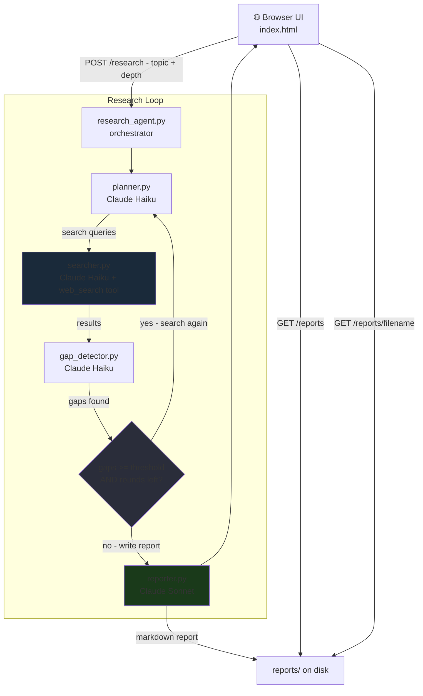

```mermaid
flowchart TD
    UI[🌐 Browser UI<br/>index.html]

    UI -->|POST /research - topic + depth| RA

    subgraph Research Loop
        RA[research_agent.py<br/>orchestrator] --> PL
        PL[planner.py<br/>Claude Haiku] -->|search queries| SR
        SR[searcher.py<br/>Claude Haiku + web_search tool] -->|results| GD
        GD[gap_detector.py<br/>Claude Haiku] -->|gaps found| DECIDE

        DECIDE{gaps >= threshold<br/>AND rounds left?}
        DECIDE -->|yes - search again| PL
        DECIDE -->|no - write report| RP
    end

    RP[reporter.py<br/>Claude Sonnet] -->|markdown report| DISK
    DISK[reports/ on disk]
    RP --> UI

    UI -->|GET /reports| DISK
    UI -->|GET /reports/filename| DISK

    style DECIDE fill:#2a2d3a
    style RP fill:#1a3a1a
    style SR fill:#1a2a3a
```
